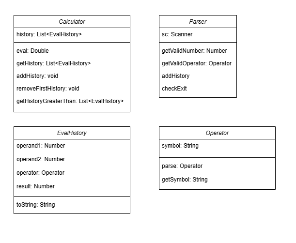
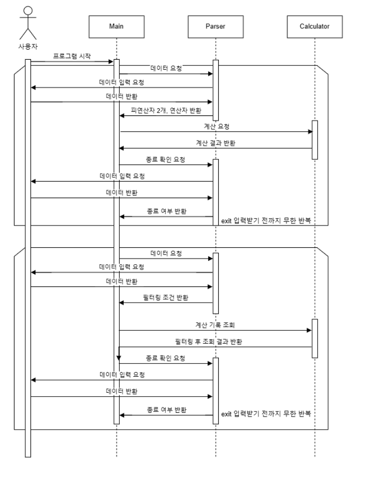

# 프로젝트 소개

자바를 학습하면서 배운 내용과 개념을 통해 클래스를 활용한 계산기와 클래스를 사용하지 않는 계산기 개발하기

---

# 개발 환경
- Windows 11
- Eclipse Temurin JDK 17
- IntelliJ Ultimate

---

# 요구사항 정의

## 요구사항 정의서
|기능명| 상세설명                                                                          |데이터| 에외 처리                                                                                                               |
|---|-------------------------------------------------------------------------------|---|---------------------------------------------------------------------------------------------------------------------|
|계산 기능| 피연산자 2개와 연산자를 입력받고 사칙연산(더하기, 빼기, 곱하기, 나누기)을 수행한다.<br>exit 문자열을 입력받기 전까지 반복된다. |피연산자 2개, 연산자| 피연산자를 입력시 숫자가 아닌 문자열을 입력받으면 다시 입력받도록 한다.<br>연산자 입력시, 정해진 연산자가 아니면 다시 입력받도록 한다.<br>나누기시 두번째 연산자가 0일 경우 계산을 수행하지 않는다. |
|계산 기록 자동 저장 기능| 한번의 계산이 끝날 때마다 기록이 저장된다.                                                      ||
|계산 기록 자동 삭제 기능| 한번의 계산이 끝나 자동으로 기록이 저장된 후, 기록이 10개보다 많을 경우 자동으로 가장 처음 기록을 삭제한다.               ||
|계산 기록 조회 기능| 계산 기능을 종료 후, 숫자 N을 입력했을 때 해당 수 보다 결과가 큰 계산 기록을 출력한다.                          |숫자 N|

## 사용자 인터페이스
콘솔 기반의 사용자 인터페이스를 사용한다.

---

# 설계

## 클래스 다이어그램


## 시퀀스 다이어그램


---

# 깃 컨벤션
- tag: subject
- body
- footer

## tag
- feat: 새로운 기능 추가
- fix: 버그 수정
- docs: 문서 수정
- style: 코드 포맷팅, 세미콜론 누락, 코드 변경이 없는 경우
- refactor: 코드 리팩토링
- test: 테스트 코드, 리팩토링 테스트 코드 추가
- chore: 빌드 업무 수정, 패키지 매니저 수정

---

# 패키지 구조
```
📂 org
└── 📂 example
    ├── 📂 constant
    │   └── 📄 Operator
    ├── 📂 operation
    │   ├── 📂 annotation
    │   │   └── 📄 Operation
    │   ├── 📄 AbstractOperation
    │   ├── 📄 AddOperation
    │   ├── 📄 DivideOperation
    │   ├── 📄 ModuloOperation
    │   ├── 📄 MultiplyOperation
    │   ├── 📄 PowerOperation
    │   ├── 📄 SubtractOperation
    ├── 📂 service
    │   ├── 📄 Calculator
    │   └── 📄 Parser
    ├── 📂 util
    │   └── 📄 NumberUtil
    ├── 📂 vo
    │   └── 📄 EvalHistory
    └── 📄 Main
```

---

# 트러블 슈팅
[link](https://dungbik.github.io/p/nb-til-7/)
